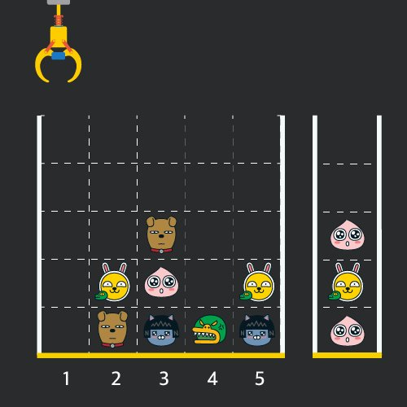

### 문제 설명
<br/>

   게임개발자인 죠르디는 크레인 인형뽑기 기계를 모바일 게임으로 만들려고 합니다.   
   죠르디는 게임의 재미를 높이기 위해 화면 구성과 규칙을 다음과 같이 게임 로직에 반영하려고 합니다.   

     

   게임 화면은 1 x 1 크기의 칸들로 이루어진 N x N 크기의 정사각 격자이며 위쪽에는 크레인이 있고 오른쪽에는 바구니가 있습니다.    
   (위 그림은 5 x 5 크기의 예시입니다).    
   각 격자 칸에는 다양한 인형이 들어 있으며 인형이 없는 칸은 빈칸입니다.    
   모든 인형은 1 x 1 크기의 격자 한 칸을 차지하며 격자의 가장 아래 칸부터 차곡차곡 쌓여 있습니다.    
   게임 사용자는 크레인을 좌우로 움직여서 멈춘 위치에서 가장 위에 있는 인형을 집어 올릴 수 있습니다.    
   집어 올린 인형은 바구니에 쌓이게 되는 데, 이때 바구니의 가장 아래 칸부터 인형이 순서대로 쌓이게 됩니다.   
   다음 그림은 [1번, 5번, 3번] 위치에서 순서대로 인형을 집어 올려 바구니에 담은 모습입니다.   

     

   만약 같은 모양의 인형 두 개가 바구니에 연속해서 쌓이게 되면 두 인형은 터뜨려지면서 바구니에서 사라지게 됩니다.    
   위 상태에서 이어서 [5번] 위치에서 인형을 집어 바구니에 쌓으면 같은 모양 인형 두 개가 없어집니다.   

      

   크레인 작동 시 인형이 집어지지 않는 경우는 없으나 만약 인형이 없는 곳에서 크레인을 작동시키는 경우에는 아무런 일도 일어나지 않습니다.    
   또한 바구니는 모든 인형이 들어갈 수 있을 만큼 충분히 크다고 가정합니다. (그림에서는 화면표시 제약으로 5칸만으로 표현하였음)   

   게임 화면의 격자의 상태가 담긴 2차원 배열 board와 인형을 집기 위해 크레인을 작동시킨 위치가 담긴 배열 moves가 매개변수로 주어질 때,    
   크레인을 모두 작동시킨 후 터트려져 사라진 인형의 개수를 return 하도록 solution 함수를 완성해주세요.   

<br/>
    
### 제한 조건
   - board 배열은 2차원 배열로 크기는 5 x 5 이상 30 x 30 이하입니다. 
   
   - board의 각 칸에는 0 이상 100 이하인 정수가 담겨있습니다.  
       - 0은 빈 칸을 나타냅니다.  
       
       - 1 ~ 100의 각 숫자는 각기 다른 인형의 모양을 의미하며 같은 숫자는 같은 모양의 인형을 나타냅니다.  
       
   - moves 배열의 크기는 1 이상 1,000 이하입니다.  
   
   - moves 배열 각 원소들의 값은 1 이상이며 board 배열의 가로 크기 이하인 자연수입니다.  
   
<br/>

### 입출력 예에 대한 설명
- 입출력 예 #1

   인형의 처음 상태는 문제에 주어진 예시와 같습니다.    
   크레인이 [1, 5, 3, 5, 1, 2, 1, 4] 번 위치에서 차례대로 인형을 집어서 바구니에 옮겨 담은 후,    
   상태는 아래 그림과 같으며 바구니에 담는 과정에서 터트려져 사라진 인형은 4개 입니다.

     

<br/><hr/><br/>

- 내 풀이 다시 처음부터 보는데 갑자기 이해가 안된다!!!!! 
    - ```board[j][moves[i]-1]```이 이해가 안되네???? 내가 왜 이렇게 작성한건지...???
    - 각 board에서 ```[moves[i]-1]```번째 값을 찾는게 문제에서 몇 번째 인형을 뽑아낸다는 것과 어떻게 같다고 생각한건가?   
      각 board에서 ```[moves[i]-1]```번째 값은 moves의 순서에 맞게 인형을 뽑는 것과 다른 거 아니야>??   
      moves의 요소는 board의 ```[i]```에 해당하는거 아닌가????? 어째서 board의 순서마다 줬지??

### 풀이 1) 
```javascript
function solution(board, moves) {
    var answer = 0;
    
    var pickArr = []; // 제일 위에서부터 뽑힌 인형 들어가있는 바구니 배열.
    
    // 바구니에 인형 넣는 함수.
    for(let i = 0; i < moves.length; i++) {
        for(let j = 0; j < board.length; j++) {
            // var pick = board[j][moves[i] - 1]; // pick으로 정의를 하니 결과값이 다르게 나온다...
            if(board[j][moves[i] - 1] !== 0) { // moves의 값에서 1을 빼줘야 해당 요소 선택됨.
                pickArr.push(board[j][moves[i] - 1]);
                // moves순서대로 각 칸의 제일 위 인형(0이 아닌)은 추출된다. 하지만 추출된 인형은 삭제해줘야한다.
                // 삭제 어떻게 하냐ㅠㅠㅠㅠㅠㅠ 안 돼ㅠㅠㅠㅠㅠ
                board[j][moves[i] - 1] = 0; // 추출된 인형은 0처리해서 없는 것처럼 인식하게 해줬다!!!
                break;
            }
            
        }

        // 이부분 다른 사람 답안 참고함!!!!!!!!!!!!!!!!!! (pop())
        // 내가 푼 방식에서는 바구니 배열의 가장 마지막 요소와 그 앞의 요소를 추출해서 비교했는데 답이 이상하게 나왔었다ㅠㅠㅠ
        while(pickArr.length > 0) {
            var firstPick = pickArr.pop(); // 마지막 요소를 추출함과 동시에 배열에서 삭제.
            // pop()으로 뽑아낸 배열 제일 아래 요소와 그 위의 요소를 비교.
            if(firstPick === pickArr[pickArr.length - 1]) {  // 두 값이 같을 경우.
                pickArr.pop(); // 두 번째 값도 삭제. (이미 첫 번째 요소를 배열에서 삭제했기 때문에, 두 번째 요소가 마지막 요소가 된 것이다. 따라서 pop()으로 마지막 요소를 삭제하면 기존에 두 번째였던 요소가 삭제되는 것과 같은 것이 된다.)
                answer += 2;
                break;
            } else {
                pickArr.push(firstPick); // 제일 아래 값과 그 위의 값이 다를 경우 기존에 배열에서 삭제했던 제일 아래 값을 다시 배열로 넣어준 것.
                break;
            }
        }
    }
    
    // 바구니에 쌓인 값(마지막 요소가 제일 바닥) = [ 4, 3, 1, 1, 3, 2, 4 ]
    return answer;
}
```
- 인터넷 참고...
- pop() 
    - 배열의 마지막 요소를 제거한 수, 제거한 요소를 반환해준다.
    - 함수 중간에서 pop()을 사용한 선언을 해주면, 선언을 해준 순간부터 그 요소는 배열에서 삭제된 것이라고 보면 된다.
    - 빈 배열에서 pop()함수를 사용하면 undefined가 반환된다.

<br/>

### 시도 1) 

- 바구니 속 같은 인형 삭제하는 부분에서 계속해서 잘못된 답이 나옴...

```javascript
function solution(board, moves) {
    var answer = 0;
    
    var pickArr = []; // 제일 위에서부터 뽑힌 인형 들어가있는 바구니 배열.
    
    // 바구니에 인형 넣는 함수.
    for(let i = 0; i < moves.length; i++) {
        for(let j = 0; j < board.length; j++) {
            // var pick = board[j][moves[i] - 1]; // pick으로 정의를 하니 결과값이 다르게 나온다...
            if(board[j][moves[i] - 1] !== 0) { // moves의 값에서 1을 빼줘야 해당 요소 선택됨.
                pickArr.push(board[j][moves[i] - 1]);
                // moves순서대로 각 칸의 제일 위 인형(0이 아닌)은 추출된다. 하지만 추출된 인형은 삭제해줘야한다.
                // 삭제 어떻게 하냐ㅠㅠㅠㅠㅠㅠ 안 돼ㅠㅠㅠㅠㅠ
                board[j][moves[i] - 1] = 0; // 추출된 인형은 0처리해서 없는 것처럼 인식하게 해줬다!!!
                break;
            }
            
        }
        
        // 바구니 속 인형 개수.
        // var pickArrLength = pickArr[pickArr.length - 1];

        // 바구니 배열 속 연달아 같이 있는 숫자 제거.
        var count = 1;
        // var firstPick = pickArr[pickArr.length - count];
        // var secondPick = pickArr[pickArr.length - (count+1)];
        while(pickArr.length > 0) {
            // count++;
            var firstPick = pickArr[pickArr.length - count]; // 바구니 속 제일 아래 인형.
            var secondPick = pickArr[pickArr.length - (count + 1)]; // 제일 아래 인형의 바로 위 인형.
            if(firstPick === secondPick) { // 바구니 속 제일 아래 인형이 그 위의 인형과 같을 경우 answer에 2 추가.(2개 다 삭제되는 거니까)
                // 같은 것은 삭제.
                pickArr.splice(secondPick, 1);
                pickArr.splice(firstPick, 1);
                answer += 2;
                break;
            } else {
                count++;
                break;
            }
            count++;
        }
    }
    
    // 바구니에 쌓인 값(마지막 요소가 제일 바닥) = [ 4, 3, 1, 1, 3, 2, 4 ]
    return answer = pickArr;
}
// 계속 잘못 된 답이 나온다. 
// 배열 속 값이 제대로 삭제되었는지 보기 위해서 배열을 보이게 해줬는데, 이상한 요소가 삭제되고 있다.....ㅠㅠㅠㅠㅠ
// 따라서 바구니 속 같은 숫자 제거하는 부분 인터넷 검색해서 참고했다 결국..


// 처음에는 아래의 풀이처럼 제일 위칸 인형을 따로 배열로 만들으니까 복잡 + 배열 속 배열로 요소가 들어가졌다. 
// 따라서 한번에 객체로 들어갈 수 있도록  위의 풀이로 바꿔줬다.
function solution(board, moves) {
    var answer = 0;
    
    var arr = []; // 각 칸의 제일 위 인형 모아둔 배열.
    // var pickArr = [];
    for(let i = 0; i < board.length; i++) {
        var pick = board[i].slice(0, 1); // 각 칸의 제일 위 인형을 추출.
        arr.push(pick);
        var pickArr = []; // 뽑힌 인형 순서대로 옮겨진 바구니 배열.(제일 아래칸 인형이 배열 속 첫번째 요소라고 보면 된다)
    }
    
    // pick을 moves의 숫자순서대로 뽑아내야되는데 어떻게 매칭하지?????????????
    for(let j = 0; j < moves.length; j++) {
        // moves순서대로 각 칸의 제일 위 인형은 추출된다. 하지만 추출된 인형은 삭제해줘야한다.
        // 삭제 어떻게 하냐ㅠㅠㅠㅠㅠㅠ 안 돼ㅠㅠㅠㅠㅠ
        if(!arr[moves[j]-1]) {
            // pickArr.push(arr[moves[j]]);
        } else {
        pickArr.push(arr[moves[j] - 1]);  
        // arr.splice(moves[j]-1, 1);
        }
    }
    //0 3 0 5 0 0 0 4
    return answer = pickArr;
}
```


